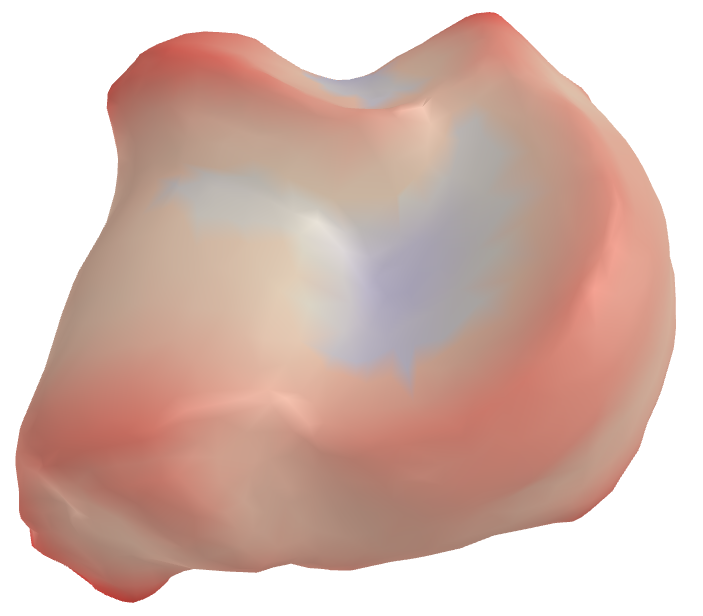
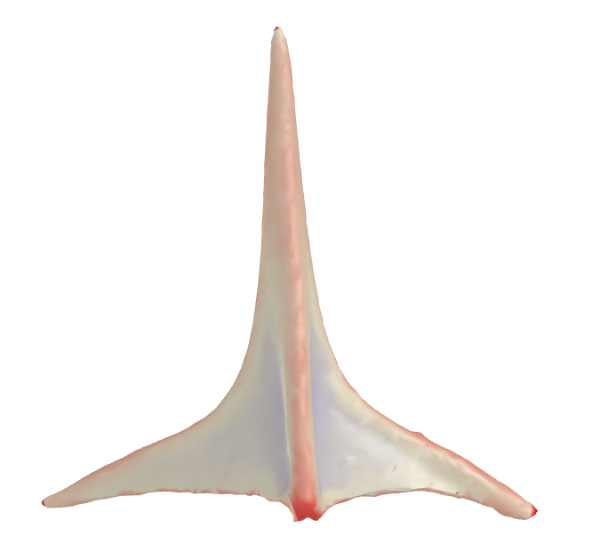
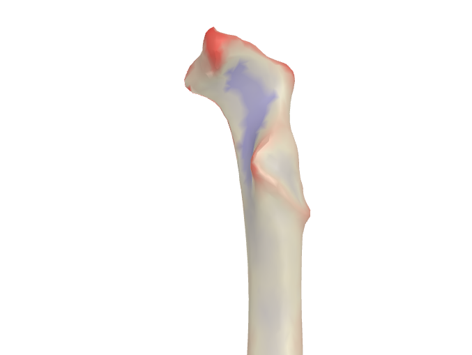
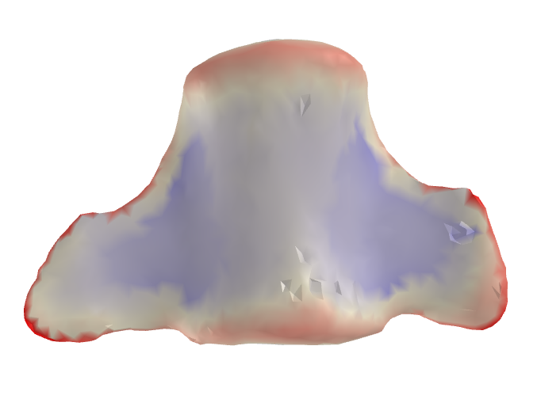
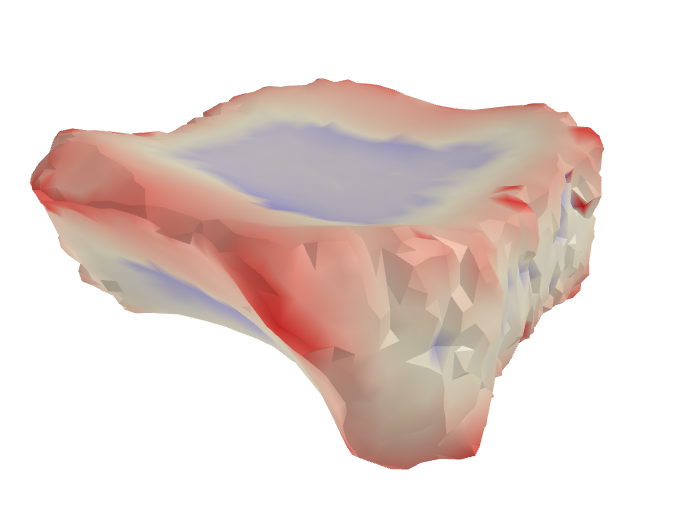
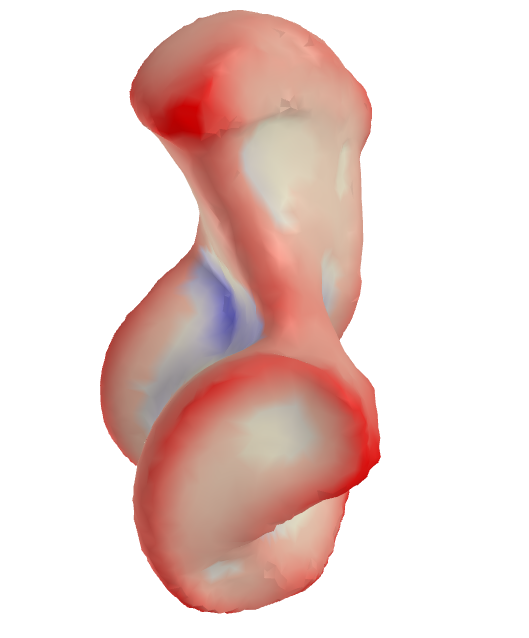

# Summary
Biological shapes and anatomical structures are fundamental to the study of evolutionary biology. Numerical descriptors that quantify the overall geometry of biological forms are essential tools for the modeling, analysis, and understanding of evolutionary processes. The Dirichlet Normal Energy (DNE) is a shape complexity metric that addresses this by summarizing the local curvature of surfaces, particularly aiding analytical studies and providing insights into evolutionary and functional adaptations. The sign-oriented DNE is a natural extension of DNE, that distinguishes between the convex and concave regions of a surface by assigning signs to each point. Specifically, it assigns a positive sign when the surface bends outward -- like a cusp or a ridge, and a negative sign when the surface bends inward -- like a valley.


{ width=33% }
{ width=33% }
{ width=33% }

<table>
  <tr>
    <td></td>
    <td></td>
    <td></td>
  </tr>
  <tr>
    <td></td>
    <td></td>
    <td></td>
  </tr>
</table>

 media identifiers. Positive curvature regions are shaded red, and negative curvature regions are shaded blue. \label{visualization-demo}](visualization-demo.png)

`signDNE` is a new Python package for calculating DNE and sign-oriented DNE. The package faithfully reproduces the robust `ariaDNE` algorithm for calculating DNE, and includes a novel algorithm for robustly determining DNE signs. The implementation improves accessibility and usability by providing a visualization tool, aiding evolutionary biologists in their research, along with batch processing features. Figure \ref{visualization-demo} illustrates the visualization functionality of the local DNE field on various biological specimens.
Alongside the new Python implementation, the original MATLAB implementation of `ariaDNE` has been updated to include the sign-oriented extension.

# Statement of need
DNE was originally proposed as a dental topographic metric and has shown considerable potential in terms of inferring dietary relationships [@winchester2014dental; @berthaume2016food; @lopez2018dental; @de2021widespread; @selig2021mammalian; @selig2024variation]. 
More recently, it has been applied to other anatomical structures, aiding in the analysis of functional and evolutionary relationships, reconstructing evolutionary pathways, and identifying adaptive traits [@stamos2020ontogeny; @thomas2020physical; @chiaradia2023tissue; @clear2023baculum; @pamfilie2023quantifying; @assemat2023shape]. 
The original DNE implementation @winchester2014dental @pampush2016introducing is sensitive to variations in the discrete representation of continuous surfaces such as perturbations of mesh resolution, number of triangle faces, surface smoothing and noise.
This led to the development of the MATLAB-based ariaDNE @shan2019ariadne, which aimed to provide a more reliable computation of DNE.

Sign-oriented DNE [@pampush2022sign], is a recent development that integrates the sign of local curvature to distinguish between concavity and convexity, adding an important layer of detail to the numerical descriptor. Its current implementation, like the original DNE, is sensitive to variations in the discrete representation of continuous shapes. Given the increasing diversity and widespread availability of 3D shape data, it is essential that implementations of the shape complexity metrics remain robust against small perturbations in the data representation.

Previous implementations of DNE and sign-oriented DNE have been written in R and MATLAB. Given the proprietary nature of MATLAB, and the limited adoption of R (compared to Python), a Python implementation provides grounds for wider adoption in the biological community. 

`signDNE` aims to fill this spot, by providing a Python implementation of the robust `ariaDNE` algorithm, faithfully reproducing the original MATLAB implementation, along with a novel robust algorithm for calculating DNE signs. Our new algorithm exhibits greater resilience to perturbations of mesh resolution, number of triangle faces, surface smoothing, and small noise during data processing. A detailed description of our algorithm, along with quantitative benchmarks demonstrating its improvement upon earlier methods, is found in preprint on arXiv [@hjerrild2024signdnepythonpackageariadne].

# Package description and documentation
The `signDNE` Python package combines the original `ariaDNE`, with the new sign-oriented extension. Users can use the package both as a standard Python library and as a standalone command-line interface (CLI). 

The core functionality is encapsulated in the function `ariaDNE`. The function takes the following inputs:

- Mesh in the format of the Trimesh library. If the mesh is not watertight, a watertight version of the mesh is generated on the fly to use for ray casting.
  
- Optional bandwidth, for specifying local influence in DNE calculation. Default is set to be $0.08$.

- Optional distance cutoff for the local neighborhoods used to calculate DNE. Default is $0$.

- Optional desired distance metric, either Euclidean or Geodesic. Default is Euclidean.

- Optional pre-computed distances. The format of which should be a symmetric $n times n$  matrix with pairwise distances, where $n$ is the number of points.

With the following outputs:

- *local_curvature*,  which is an ordered list of the signed local bending estimates for each vertex.

- *local_dne*, which is local_curvature weighted by the vertex area. The vertex area is defined as the average area of the adjacent triangular faces.

- *dne*, which is the original DNE value. This is also the sum of *local_dne*.

- *positive_dne*, which is the positive component of DNE.

- *negative_dne*, which is the negative component of DNE.

- *surface_area*, which is the total surface area of the input mesh.

- *positive_surface_area*, which is the surface area of the positive DNE regions.

- *negative_surface_area*, which is the surface area of the negative DNE regions.

The CLI offers a convenient interface for directly processing files using this function, streamlining workflows and enhancing usability for different applications. Easy assessment of parameter choice is crucial for practicing biologists to efficiently use shape complexity metrics. This is addressed by providing a visualization tool that allows for quick assessment of parameter choice. The CLI features batch processing, namely, recursive folder processing and multiple file processing. By default, results are written to `STDOUT`, but can optionally be exported as a CSV file.

Below are examples demonstrating basic CLI features.

Calculating DNE or signDNE values for multiple files and save result as a file:

```bash
$ signDNE path/to/mesh1.obj path/to/mesh2.ply -o DNEs.csv
```

Calculate DNE or signDNE for all files in a folder with a custom bandwidth:

```bash
$ signDNE path/to/mesh/directory -b 0.1
```

Full documentation is available at the [`SignDNE` repository](https://github.com/frisbro303/signDNE_Python).

# Acknowledgement
DB is supported by NSF BCS 1552848 and NSF DBI 1759839. ID acknowledges the support of the Math+X grant 400837 from the Simons Foundation. 

# References
