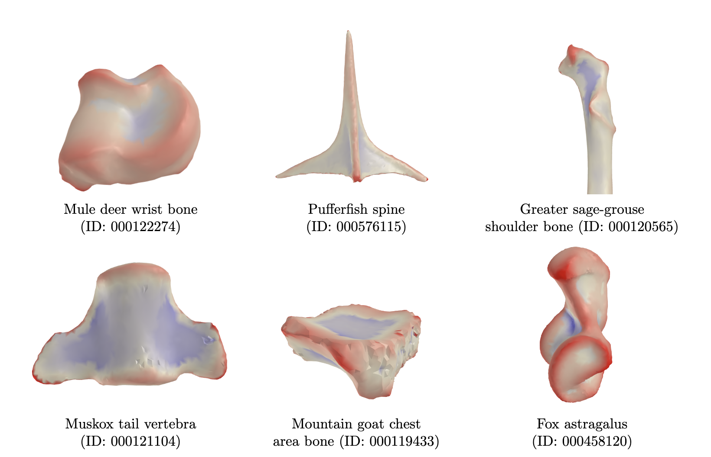

# Summary
Biological shapes and anatomical structures are fundamental to the study of evolutionary biology. Numerical descriptors that quantify the overall geometry of biological forms are essential tools for the modeling, analysis, and understanding of evolutionary processes. The Dirichlet Normal Energy (DNE) is a shape complexity metric that addresses this by summarizing the local curvature of surfaces, particularly aiding analytical studies and providing insights into evolutionary and functional adaptations. The sign-oriented DNE is a natural extension of DNE, that distinguishes between the convex and concave regions of a surface by assigning signs to each point. Specifically, it assigns a positive sign when the surface bends outward -- like a cusp or a ridge, and a negative sign when the surface bends inward -- like a valley.

`signDNE` is a new Python package for calculating DNE and sign-oriented DNE. The package faithfully reproduces the robust `ariaDNE` algorithm for calculating DNE, and includes a novel algorithm for robustly determining DNE signs. The implementation improves accessibility and usability by providing a visualization tool, aiding evolutionary biologists in their research, along with batch processing features. @visualization-demo illustrates the visualization functionality of the local DNE field on various biological specimens.
Alongside the new Python implementation, the original MATLAB implementation of `ariaDNE` has been updated to include the sign-oriented extension.

# Acknowledgement
DB is supported by NSF BCS 1552848 and NSF DBI 1759839. ID acknowledges the support of the Math+X grant 400837 from the Simons Foundation. 

# References
